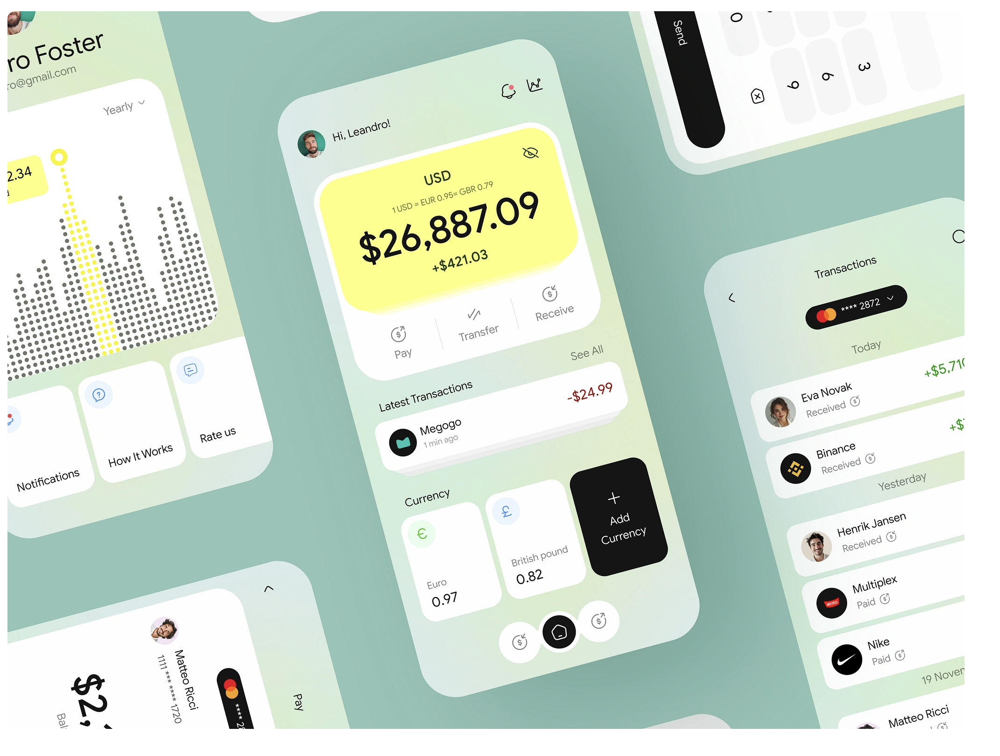

# Personal Banking App

## 🚀 Project Status: **In Progress** 🏗️

## Getting Started

This project is currently under development. Stay tuned for updates!

## 📱 App Screenshot


# Flutter Project Folder Structure (BLoC + API)

This document outlines the folder structure for a Flutter project following **BLoC state management** and a **clean architecture** approach. The structure is designed for scalability, testability, and maintainability.

---

## **📂 Folder Structure Overview**
```
lib/
│── core/                     # Core utilities (API, errors, themes, etc.)
│   ├── api/                  # API-related services
│   │   ├── api_client.dart   # Base API client (Dio/HttpClient)
│   │   ├── endpoints.dart    # API endpoint constants
│   │   ├── api_exceptions.dart # Custom error handling
│   │   ├── network_info.dart # Network connectivity check
│   ├── config/               # App-wide configurations (themes, constants)
│   ├── utils/                # Helper functions, extensions, validators
│
│── data/                     # Data sources and repositories
│   ├── models/               # Data models (JSON parsing, etc.)
│   │   ├── user_model.dart   # Example model class
│   ├── repositories/         # Business logic (fetch data from API)
│   │   ├── user_repository.dart # Example repository
│   ├── local/                # Local storage (Hive, SharedPreferences, etc.)
│
│── domain/                   # Business logic layer
│   ├── entities/             # Core data models (used in UI)
│   │   ├── user_entity.dart  # Example entity class
│   ├── repositories/         # Abstract classes for repositories
│   ├── use_cases/            # Business logic (combine multiple repositories)
│
│── presentation/             # UI layer
│   ├── screens/              # All screens (organized per feature)
│   │   ├── home/
│   │   │   ├── home_screen.dart
│   │   │   ├── home_bloc.dart
│   │   │   ├── home_event.dart
│   │   │   ├── home_state.dart
│   │   │   ├── home_widgets.dart
│   ├── widgets/              # Reusable UI components
│   ├── themes/               # Theme and styling files
│
│── main.dart                 # App entry point
│── routes.dart               # App routing (GoRouter, Navigator 2.0)
│── injection.dart            # Dependency injection setup (GetIt, Provider, etc.)
│── app.dart                  # Root widget
│
├── test/                     # Unit & widget tests
│── pubspec.yaml              # Dependencies
```

---

## **📂 Folder Breakdown**

### **1️⃣ Core Layer (`core/`)**
- `api/` → Handles all API communication.
  - `api_client.dart` → Sets up API calls using `Dio` or `http`.
  - `endpoints.dart` → Defines API endpoint URLs.
  - `api_exceptions.dart` → Handles API error responses.
  - `network_info.dart` → Checks internet connectivity.
- `config/` → Contains app-wide settings like themes and constants.
- `utils/` → Helper functions, extensions, and validators.

### **2️⃣ Data Layer (`data/`)**
- `models/` → Defines data models used for JSON serialization.
- `repositories/` → Business logic for fetching and processing data.
- `local/` → Local storage options like SQLite, Hive, and SharedPreferences.

### **3️⃣ Domain Layer (`domain/`)**
- `entities/` → Core data objects used by the UI.
- `repositories/` → Abstract classes for repositories.
- `use_cases/` → Business logic operations (e.g., fetching a user profile).

### **4️⃣ Presentation Layer (`presentation/`)**
- `screens/` → Organizes UI screens per feature.
- `widgets/` → Reusable UI components.
- `themes/` → App-wide theme settings.

### **5️⃣ Main Files**
- `main.dart` → Entry point of the application.
- `routes.dart` → Manages app navigation.
- `injection.dart` → Handles dependency injection setup.
- `app.dart` → Root widget of the application.

---

## **🚀 Best Practices**
✅ Follow **Separation of Concerns** by keeping API calls, UI, and business logic in separate layers.
✅ Use **BLoC** for better state management.
✅ Implement **Dependency Injection** with `GetIt` or `Provider`.
✅ Keep **UI components reusable** in the `widgets/` folder.
✅ Follow **feature-based folder structure** to scale easily.

---

This structure ensures a **clean, scalable, and maintainable** Flutter project. 🚀


